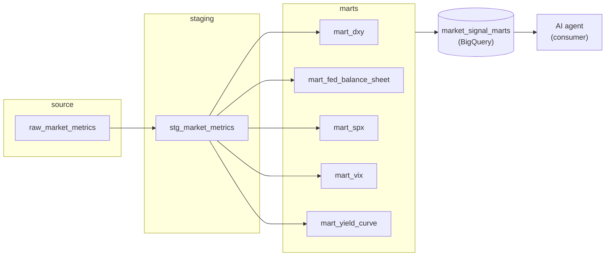

# Market Signal Stack

[](https://www.getdbt.com/)
[](https://cloud.google.com/bigquery)
[](LICENSE)

A dbt pipeline over BigQuery that turns raw macro, crypto, and on-chain market data into normalized signals feeding an AI agent that evaluates Bitcoin's market cycle.

## Contents
- [Architecture](#architecture)
- [Current status](#current-status)
- [Indicators in progress](#indicators-in-progress)
- [Roadmap](#roadmap)
- [Running it](#running-it)
- [Tests and quality guarantees](#tests-and-quality-guarantees)

## Architecture



- **`raw_market_signals`**: the BigQuery dataset where raw data is loaded. dbt doesn't build it, it only reads it as a `source`.
- **`models/staging/`**: minimal cleanup (type casting, column selection) on top of the raw data. No business logic. Materialized as `ephemeral` — it never lands as its own table, it's inlined into the models that use it.
- **`models/marts/`**: where each indicator's calculation lives — the real business logic. Materialized as a table in `market_signal_marts`, the dataset consumed by the agent through a read-only service account.

## Current status

Five indicators built, all in the Macro Global layer:

- **Yield Curve (10Y-2Y)** (`mart_yield_curve`): spread between the 10-year and 2-year US Treasury yields, a recession-risk and risk-appetite signal. Computes the daily spread, a categorical signal (`BULLISH` / `NEUTRAL` / `BEARISH`) with a normalized value, and applies forward-fill when one of the two series is missing for a given day — each row explicitly flags whether its value is real or carried forward (`is_dgs2_imputed`, `is_dgs10_imputed`).
- **FED Balance Sheet (QE/QT)** (`mart_fed_balance_sheet`): weekly change in the Federal Reserve's balance sheet (WALCL), a liquidity expansion/contraction signal. Computes the week-over-week delta and the same normalized categorical signal.
- **DXY (US Dollar Index)** (`mart_dxy`): distance of the US Dollar Index from its 50-day moving average, a global liquidity pressure signal. The signal is left `NULL` until 50 days of real history accumulate (it never computes a partial average as if it were complete) — this resolves itself as more data comes in.
- **VIX (Volatility Index)** (`mart_vix`): z-score (capped at ±3) of the VIX's 20-day moving average against its 750-day history, a risk-aversion signal. Same as DXY, the signal is left `NULL` until the window is complete — see [Indicators in progress](#indicators-in-progress).
- **S&P 500 Risk Regime** (`mart_spx`): distance of the S&P 500 from its 200-day moving average, a structural risk-appetite signal. Same as DXY, the signal is left `NULL` until 200 days of real history accumulate.

All five follow the same pattern: generic staging, a mart with the business logic, rules documented in `docs/indicator_rules/`, tests, and a data contract.

## Indicators in progress

Some indicators (VIX and SPX now; NDX next) are already built and working, but their calculation depends on a history window the project hasn't fully accumulated yet — for example, VIX needs 750 observations of its 20-day moving average to compute a reliable z-score, and SPX needs 200 days for its moving average, and today there are far fewer.

In the meantime, those marts intentionally return `NULL` for `signal`/`normalized_value` — **this is not a bug**. A guardrail (`COUNT() OVER` the same window) prevents computing an average or z-score from fewer observations than the formula requires, instead of silently returning a partial result dressed up as a complete one. This resolves itself, with no code changes, as more historical data loads in.

**MOVE** is still pending review before being built: it has an irregular load cadence (12 rows over 16 days as of the last check), so before applying this same pattern to it, that needs to be understood as either expected at the source or a loading issue.

## Roadmap

Yield Curve, FED Balance Sheet, DXY, VIX, and SPX are the first indicators in a broader **Macro Global** layer — macroeconomic signals meant to feed BTC market-cycle evaluation. The plan is to keep expanding this layer with more macro indicators reusing the same pattern (staging, mart, versioned rules, tests, data contract), and to use it as the foundation for other signal layers down the line.

## Running it

Requires Python 3.11+, [uv](https://docs.astral.sh/uv/), and access to the GCP project this pipeline targets.

```bash
uv sync                # install dependencies
uv run dbt deps        # install dbt packages (dbt_utils)
uv run dbt debug        # verify the BigQuery connection
uv run dbt run          # build the models
uv run dbt test         # run the tests
```

`profiles.yml` is not in this repo — it lives at `~/.dbt/profiles.yml` on each machine, with the BigQuery credentials (including the real GCP project ID). It needs to be created separately before running anything; `dbt debug` confirms whether it's set up correctly.

## Tests and quality guarantees

This pipeline isn't a loose script: every layer has its own automated checks.

- **Source freshness**: warns if the raw data hasn't updated in over 1 day, and fails past 3 days (only for the daily-cadence metrics).
- **Data integrity**: key columns are never null, and the metric + date combination is unique (no duplicates).
- **Forward-fill guardrail**: a dedicated test fails if an indicator has been carrying forward the same value for more than 5 days in a row — a sign the source pipeline stopped delivering data and no one noticed.

For finer technical detail — code conventions, exact commands, known gotchas — see [CLAUDE.md](CLAUDE.md).
