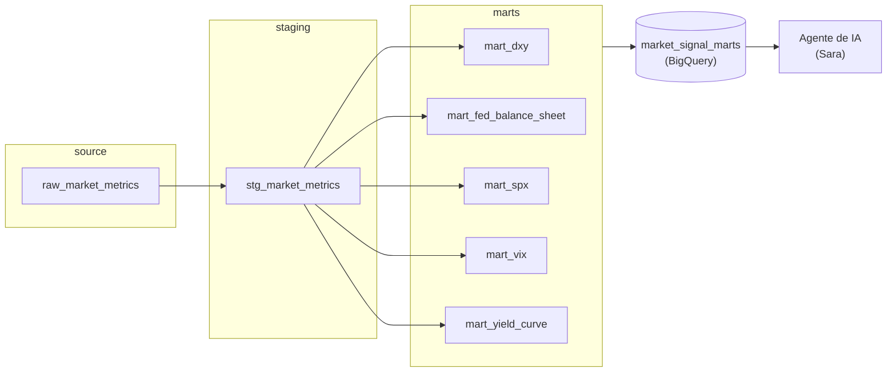

# Market Signal Stack

[](https://www.getdbt.com/)
[](https://cloud.google.com/bigquery)
[](LICENSE)

Pipeline de indicadores macro, cripto y on-chain construido en dbt sobre BigQuery. Transforma datos crudos de mercado en señales normalizadas que alimentan un agente de IA para evaluar el ciclo de mercado de Bitcoin.

## Contenidos
- [Arquitectura](#arquitectura)
- [Estado actual](#estado-actual)
- [Indicadores en construcción](#indicadores-en-construcción)
- [Roadmap](#roadmap)
- [Cómo correrlo](#cómo-correrlo)
- [Tests y garantías de calidad](#tests-y-garantías-de-calidad)

## Arquitectura



- **`raw_market_signals`**: dataset de BigQuery donde se carga los datos crudos. dbt no lo construye, solo lo lee como `source`.
- **`models/staging/`**: limpieza mínima (cast de tipos, columnas seleccionadas) sobre el dato crudo. Sin lógica de negocio. Materializado como `ephemeral` — no deja tabla propia, se inyecta en los modelos que lo usan.
- **`models/marts/`**: aquí vive el cálculo de cada indicador — la lógica de negocio real. Se materializa como tabla en `market_signal_marts`, el dataset que se consume desde el agente con una cuenta de servicio de solo lectura.

## Estado actual

Cinco indicadores construidos, todos en la capa Macro Global:

- **Yield Curve (10Y-2Y)** (`mart_yield_curve`): spread entre los tipos del Tesoro de EE. UU. a 10 y 2 años, señal de riesgo de recesión y de apetito por activos de riesgo como BTC. Calcula el spread diario, una señal categórica (`BULLISH` / `NEUTRAL` / `BEARISH`) con valor normalizado, y aplica forward-fill cuando falta el dato de una de las dos series — cada fila indica explícitamente si su valor es real o arrastrado (`is_dgs2_imputed`, `is_dgs10_imputed`).
- **FED Balance Sheet (QE/QT)** (`mart_fed_balance_sheet`): variación semanal del balance de la Reserva Federal (WALCL), señal de expansión o contracción de liquidez. Calcula el delta semana a semana y la misma señal categórica normalizada.
- **DXY (US Dollar Index)** (`mart_dxy`): distancia del índice del dólar respecto a su media móvil de 50 días, señal de presión de liquidez global. La señal se deja en `NULL` hasta acumular 50 días de histórico real (no calcula una media parcial como si fuera completa) — se resuelve solo según entren más datos.
- **VIX (Volatility Index)** (`mart_vix`): z-score (capado a ±3) de la media móvil de 20 días del VIX frente a su historial de 750 días, señal de aversión al riesgo. Igual que DXY, la señal se deja en `NULL` mientras no haya ventana completa — ver [Indicadores en construcción](#indicadores-en-construcción).
- **S&P 500 Risk Regime** (`mart_spx`): distancia del S&P 500 respecto a su media móvil de 200 días, señal estructural de apetito por riesgo global. Igual que DXY, la señal se deja en `NULL` hasta acumular 200 días de histórico real.

Los cinco siguen el mismo patrón: staging genérico, mart con la lógica de negocio, reglas documentadas en `docs/indicator_rules/`, tests y contrato de datos.

## Indicadores en construcción

Algunos indicadores (VIX y SPX ahora; próximamente NDX) ya están construidos y funcionando, pero su cálculo depende de una ventana de histórico que el proyecto todavía no ha acumulado por completo — por ejemplo, VIX necesita 750 observaciones de su media móvil de 20 días para calcular un z-score fiable, y SPX necesita 200 días para su media móvil, y hoy hay muchas menos.

Mientras tanto, esos marts devuelven `NULL` en `signal`/`normalized_value` de forma intencional — **no es un bug**. Un guardrail (`COUNT() OVER` la misma ventana) impide calcular una media o z-score con menos observaciones de las que la fórmula requiere, en vez de silenciosamente devolver un resultado parcial disfrazado de completo. Esto se resuelve solo, sin cambios de código, según se acumule más historial de carga.

**MOVE** queda pendiente de revisar con Sara antes de construirlo: tiene una cadencia de carga irregular (12 filas en 16 días en la última revisión), así que antes de aplicarle este mismo patrón hay que entender si eso es esperado en la fuente o un problema de carga.

## Roadmap

Yield Curve, FED Balance Sheet, DXY, VIX y SPX son los primeros indicadores de una capa más amplia de **Macro Global** — señales macroeconómicas pensadas para alimentar la evaluación del ciclo de mercado de BTC. La idea es seguir ampliando esta capa con más indicadores macro reutilizando el mismo patrón (staging, mart, reglas versionadas, tests, contrato de datos), y usarla como base para otras capas de señal más adelante.

## Cómo correrlo

Requiere Python 3.11+, [uv](https://docs.astral.sh/uv/) y acceso al proyecto de GCP `market-signal-stack`.

```bash
uv sync                # instala dependencias
uv run dbt deps        # instala paquetes dbt (dbt_utils)
uv run dbt debug        # verifica la conexión a BigQuery
uv run dbt run          # construye los modelos
uv run dbt test         # corre los tests
```

`profiles.yml` no está en este repo — vive en `~/.dbt/profiles.yml` de cada máquina, con las credenciales de BigQuery. Hay que crearlo aparte antes de correr nada; `dbt debug` confirma si está bien configurado.

## Tests y garantías de calidad

El pipeline no es un script suelto: cada capa tiene sus propias comprobaciones automáticas.

- **Freshness del source**: alerta si los datos crudos llevan más de 1 día sin actualizarse, y falla si llevan más de 3 (solo para las métricas de cadencia diaria).
- **Integridad de datos**: columnas clave nunca nulas, y combinación única de métrica + fecha (sin duplicados).
- **Guardrail de forward-fill**: un test dedicado falla si un indicador lleva más de 5 días seguidos arrastrando el mismo valor — señal de que el pipeline de origen dejó de traer datos y nadie se ha dado cuenta.

Para el detalle técnico más fino — convenciones de código, comandos exactos, gotchas conocidos — consulta [CLAUDE.md](CLAUDE.md).
